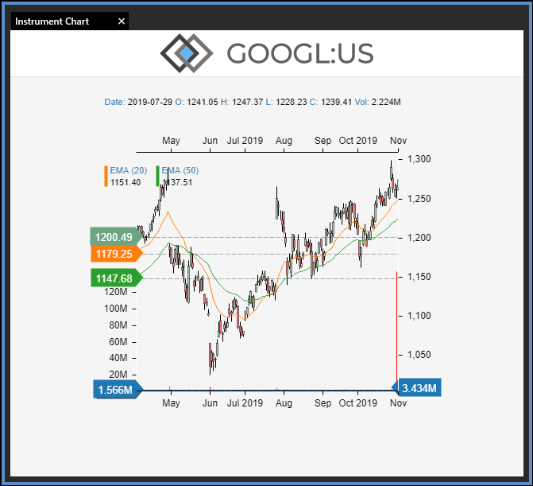

Glue42 Instrument Chart ReactJS Demo Application
====

# Description
Demonstrates the usage of Glue42 Shared Contexts to update a financial
instrument chart.

# Instructions:
1. Install Glue42 Enterprise.
2. Clone the repository to a local directory, e.g. C:\work\instrument-chart.
3. Open a command prompt and navigate to the folder (e.g. `cd C:\work\instrument-chart`).
4. Run `npm install`.
5. Navigate to the `glue42` subdirectory via File Explorer.
6. Start the `start.bat` file via a double-click.
7. Start **Glue42 Desktop** if not started already
8. Use the App Manager dropdown to start the **Instrument Chart**

# Result:

